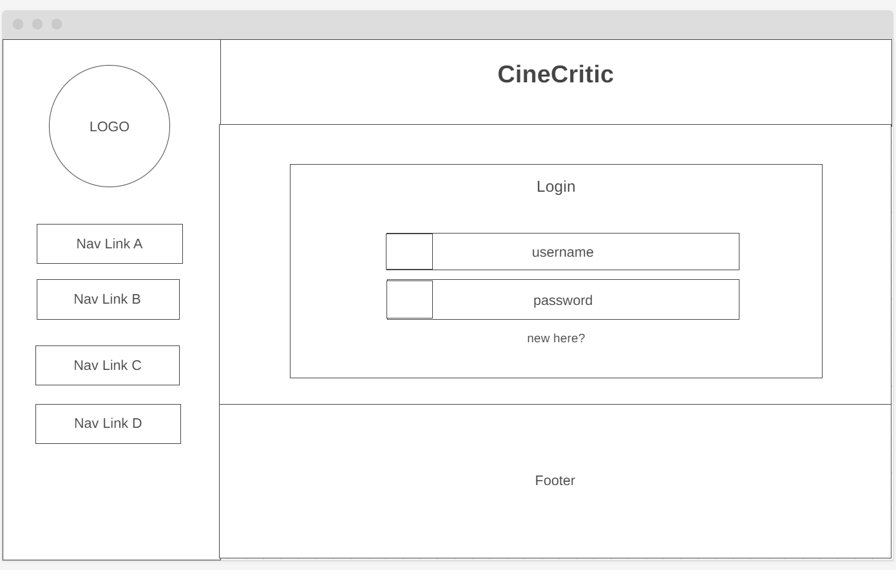

# **CineCritic - The house of tasteful cinema critique!**

## **Introduction**

CineCritic is a profile based movie review web application dedicated to movie enthousiasts that enjoy sharing thoughts around their favorite films.

*Welcome to [CineCritic](https://cine-critic-0310d8ee3de7.herokuapp.com/)*

# **Contents**

- [**CineCritic - The house of tasteful cinema critique!**](#cinecritic---the-house-of-tasteful-cinema-critique)
    - [**Introduction**](#introduction)
- [**Contents**](#contents)
- [**User Experience (UX)**](#user-experience-ux)
    - [**User Stories**](#user-stories)
    - [**Wireframes**](#wireframes)
    - [**Site Structure**](#site-structure)
  - [**Design**](#design)
- [**Features**](#features)
  - [**Existing features**](#existing-features)
  - [**Future Features**](#future-features)
- [**Technologies Used**](#technologies-used)
- [**Testing**](#testing)
- [**Deployment**](#deployment)
    - [**Project Deployment Instructions**](#project-deployment-instructions)
    - [**Forking the Repository on GitHub**](#forking-the-repository-on-github)
    - [**Creating a Local Clone of this Project**](#creating-a-local-clone-of-this-project)
- [**Credits**](#credits)
- [**Acknowledgements**](#acknowledgements)

  

# **User Experience (UX)**

## **User Stories**

- User Authentication:
    - As a new user, I want to be able to create a user profile with a unique username and password, so that I can access app features.
    - As a new user, I want a user-friendly registration page with clear formatting rules for my creadetials.
    - As a registered user, I want to be able to log in securely using my username and password, so that I can access my account and its features.
- User Profile:
    - As a user, I want to have a dedicated profile page with all my reviews, so that I have immediate access to my personal user ativity.
- Movie Management:
    - As a user, I want to be able to search for movies from an external API using keywords, so that I can find movies to review.
    - As a user, I want to be able to automatically retrieve details for the movies I am reviewing, so that I have a clear idea of the film I am discussing.
    - As a user, I want to be able to see a list of all movies added to the app, so that I can browse through them.
    - As a user, I want movies without any review to be automatically removed from the movie list, so I am aware of the films already reviwed in the app.
- Review Management:
    - As a user, I want to be able to add a review for a movie, so that I can share my thoughts and opinions with other users.
    - As a user, I want to be able to view all reviews for a specific movie, so that I can see what other users have said about it.
    - As a user, I want to be able to update or edit my own review for a movie, in case I want to make any changes.
    - As a user, I want to be able to delete my own review for a movie, if I no longer want it to be visible on the app.
- Upvoting/Downvoting:
    - As a user, I want to be able to upvote or downvote a review made by another user based on my preference, so that I can show my appreciation for it.
    - As a user, I want to be limited to upvoting/downvoting each review only once, to ensure fair voting.
- Admin User:
    - As an admin user, I want to have access to all reviews added in the application, so that I can efficiently manage any potential unwanted activity such as offensive reviews.
- Additional Features:
    - As a user, I want to be able to access the IMDB page of a movie directly from the app, so that I can learn more about it.
    - As a user, I want the app to have a responsive design, so that I can use it seamlessly on different devices.

  
[Back to top](<#contents>)

## **Wireframes**

The wireframes for ArtMatch were produced in [Balsamiq](https://balsamiq.com). Inclued below, frames can be found for all distinct pages (home, rules, board) in desktop, mobile and tablet view as they were initially envisioned.

- Home Page

    - *Laptop*

    

    - *Tablet*

    

    - *Mobile*
    
    

- Login/Register Page

    - *login/Register*

    

- Profile Page

    - *Profile*

    
  

- Movie Card Page

    - *Movie Card*

    

- Add/Edit Review Page

    - *Add/Edit Review*

    

[Back to top](<#contents>)

## **Site Structure**

The site consists of 7 main pages (plus a [404](https://cine-critic-0310d8ee3de7.herokuapp.com/404) error page) with the main landing page being the [movies_list](https://cine-critic-0310d8ee3de7.herokuapp.com) where registered and unregistered users can see a list of the movies being reviewed in the app. The user can either click on a movie to see details about the movie and reviews written by other users in the movie_card page, or they can use the navigation links on the side to [login](https://cine-critic-0310d8ee3de7.herokuapp.com/login) or [register](https://cine-critic-0310d8ee3de7.herokuapp.com/register).
Once logged in, a user can now access more pages, such as the [add_movie](https://cine-critic-0310d8ee3de7.herokuapp.com/search) page, where they can add a new movie to review by requesting the movie from the [OMDB](https://www.omdbapi.com) API to review. Additionally, a user can visit their profile page, where they can see all their reviews, visit specific movie cards and edit their reviews or delete them.

Some pages are not linked since they require specific permissions or are subject to constant change.

[Back to top](<#contents>)

## **Design**

- *Typography*

All text on the website is using a variation of the "Mulish" font family found on [Google Fonts - Mulish](https://fonts.google.com/specimen/Mulish)

- *Colour palette*

The color pallete chosen for the website consists of four main colors: Bone, Liver Chestnut (Horses), White Coffee and Platinum. All colors are solf and pale to profide for a calming, elegant and welcoming experience.

[Back to top](<#contents>)

# **Features**

The CineCritic wesite is designed to be simple to navigate and easy to use. It includes a variety of features to support a profile based experience, CRUD functionality for reviews and extenral API requests to a movie database.

## **Existing features**

- ### **Navigation Menu**

    Can be found on the side of all pages of the website pages below the logo. Makes navigation through pages easy and intuitive.
    The navigation menu is fully responsive to accomodate users of all decvces. The active page is always highlighted. All other menu items are changing color when hovered over to increase usability.

    - *Navigation Menu*

        

- ### **User Profiles**

    Users can create a personalized profile on CineCritic by registering with a unique username and password. This feature enables users to access exclusive content, CRUD functionality for movie reviews and interact with the community. The login interface allows existing users to securely sign in to their accounts, while the registration form enables new users to create an account by providing necessary details.

    - *login*

        

    - *Register*

        
    
    - *Admin User*

        An admin user has access to an exclusive admin profile where they can monitor all reviews made on the website. This includes the ability to view, edit, delete, and create reviews as necessary, providing comprehensive control over user-generated content.

        - *Admin*

            
    
    - *Profile Page*

        - *Personalized Profile Page*

            Each user has their own personalized profile page where they can view a comprehensive list of all their reviews. This page serves as a centralized hub for users to manage and track their contributions to the platform.
        
        - *Review Details and Edit Mode*

            Users have the ability to access additional details and enter edit mode for each review. By clicking on a specific review entry, users are redirected to the movie card page corresponding to their particular review. Here, they can view comprehensive information about the movie and make edits to their review if necessary.
        
        - *Profile Page*

            

- ### **Movie Card**

    The movie card page provides comprehensive details about a specific movie, including its title, plot synopsis, director, actors, release year, and other relevant information. Additionally, users can view a list of all reviews submitted for that particular movie. Furthermore, users can edit/delete their own reviews as weill as upvote or downvote reviews created by other users. Last but not least, a user can redirect themselves to IMDB page of the specific movie they are looking for in order to access more infomation about it.

    - *Movie Card*

         

- ### **Header and Footer**

    - *Header*

        The header section of the website contains the name and slogan, providing users with a quick and clear identification of the website. This minimalistic design approach ensures that the header remains uncluttered and focused on conveying the core identity of the platform.
    
    - *Footer*

        The footer section of the website displays credits, acknowledging the contributors and creators of the platform. This section serves as a gesture of appreciation towards those who have contributed to the development and maintenance of the website.

- ### Reviewing A Movie**

    - **Movie Search and Database Integration**

        Users can search for movies by title through an integrated communication with an external movie API - OMDB (Open Movie Database). Upon finding the desired movie, users can add it to the website's database along with essential details like plot synopsis, director, actors, poster image, and year of release. 

        - *Search and Add Movie*

            
    
    - **Review Functionality**

        Once a movie is added to the database, users can review it. All users have the ability to review movies listed on the website. Users can share their opinions, ratings, and comments, contributing to the community's collective feedback on the movie. Movies with no reviews will automatically be removed from the database.

        - *Review a Movie*

            
    
    - **User Review Management**

        Users have control over their own reviews. They can edit or delete their reviews as needed, allowing them to update their opinions or remove outdated content. Additionally, users can interact with reviews from other users by upvoting or downvoting them, expressing their agreement or disagreement with the provided feedback.

        - Edit/Delete Review

        - Upvote/Downvote Review

        - *Review a Movie*

            

[Back to top](<#contents>)

# **Technologies Used**

- [Python](https://www.python.org) - backend
- [Flask](https://flask.palletsprojects.com/en/3.0.x/) - templating framework
- [MongoBD](https://www.mongodb.com) - database
- [HTML5](https://html.spec.whatwg.org) - content and structure of the website via templating
- [CSS3](https://www.w3.org/Style/CSS/Overview.en.html) - styling
- [JavaScript](https://www.w3schools.com/js/) - browser functionality
- [OMDB](https://www.omdbapi.com) -  movie db extrenal API
- [Wireframe.cc](https://wireframe.ccm) - wireframes
- [GitHub](https://github.com) - hosting and storing
- [Heroku](https://wireframe.cc) - deployment
- [Gitpod](https://gitpod.io/) - coding workspace
- [GIMP](https://www.gimp.org) - image editing
  
[Back to top](<#contents>)

# **Testing**

Please follow this [link](./TESTING.md) to learn more about testing CineCritic.

[Back to top](<#contents>)

# **Deployment**

### **Project Deployment Instructions**

This website is deployed on GitHub pages. Follow these steps to deploy a project:

  1. In the GitHub repository, go on the **Settings** tab.
  2. In the Settings menu, move to the **Pages** section on the left-hand side.
  3. In **Source**, select the **main** branch and click **save**.
  4. After selecting the master branch, the page will automatically reload, displaying a ribbon indicating the successful deployment.

  You can access the live link to the GitHub deployed version - [https://sergpapa.github.io/FPC/](https://sergpapa.github.io/FPC/)

### **Forking the Repository on GitHub**

To create a duplicate of the GitHub Repository, known as forking, you can view and make changes to this copy without impacting the original repository. To fork the repository, follow these steps:

1. Log in on **GitHub** and find the [repository](https://github.com/sergpapa/Art-match).
2. On the right-hand side of your page, next to the repository name, you can find a **Fork** button. Click it to create a duplicate of the original repository in your GitHub account.

### **Creating a Local Clone of this Project**

To clone this project from GitHub to your local environment, follow these steps:

1. Below the repository's name, click on the **Code** tab.
2. Under **Clone with HTTPS**, click on the clipboard icon to copy the URL.

3. In your prefered IDE, open **Git Bash**.
4. Change the current working directory to the location where you want to create the cloned directory.
5. Type **git clone**, and then paste the copied URL from GitHub.
6. Press **enter** to vcreate the local clone.

[Back to top](<#contents>)

# **Credits**

- Font: [Google Fonts](https://fonts.google.com)
- Icons: [Fontawesome](https://fontawesome.com)
- Movie DB: [OMDB](https://www.omdbapi.com)
- Logo: [LOGO](https://logo.com)
- Wireframes: [Wireframe.cc](https://wireframe.cc)
- Image Editing: [GIMP 2.10.34](https://www.gimp.org)
- Color Palette: [Coolors](https://coolors.co)

[Back to top](<#contents>)

# **Acknowledgements**

This website was developed as a part of my Portfolio 3 Project for the Web Application Developemnt Diploma at the [Code Institute](https://codeinstitute.net/). I want to express my gratitude to my mentor, [Precious Ijege](https://www.linkedin.com/in/precious-ijege-908a00168/), as well as the Slack community and everyone at the Code Institute for their valuable assistance and support throughout this project.

Sergios Papastergiou
2024