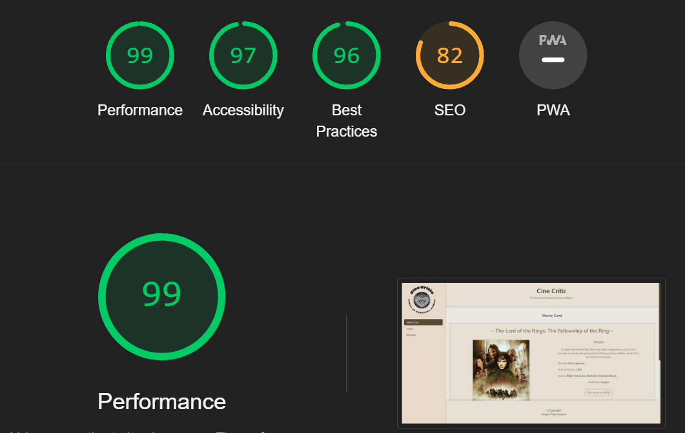

# **TESTING**

The ArtMatch website has been tested manually as well as with automated services like code validators and browser developer tools.

# **Contents**

- [**TESTING**](#testing)
- [**Contents**](#contents)
  - [**Code Validators**](#code-validators)
    - [*w3schools HTML Validator*](#w3schools-html-validator)
    - [*w3schools CSS Validator*](#w3schools-css-validator)
    - [*JsHint JavasScript Validator*](#jshint-javasscript-validator)
  - [**Features Testing**](#features-testing)
  - [**Responsiveness Test**](#responsiveness-test)
  - [**Browser Compatibility**](#browser-compatibility)
  - [**Testing User Stories**](#testing-user-stories)
  - [**Perofrmance**](#perofrmance)
    - [**User Profiles**](#user-profiles)
    - [**Movie Card**](#movie-card)
    - [**Header and Footer**](#header-and-footer)
  - [**Known Bugs**](#known-bugs)
    - [**Resolved**](#resolved)
  - [**Additional Testing**](#additional-testing)
    - [**Lighthouse**](#lighthouse)
  
## **Code Validators**

### *[w3schools HTML Validator](https://validator.w3.org)*

- [Movie List](https://cine-critic-0310d8ee3de7.herokuapp.com/movies_list)
  
  

- [Login](https://cine-critic-0310d8ee3de7.herokuapp.com/login)
  
  

- [Register](https://cine-critic-0310d8ee3de7.herokuapp.com/register)
  
  

- [Add Movie](https://cine-critic-0310d8ee3de7.herokuapp.com/search)
  
  

- [Profile](https://cine-critic-0310d8ee3de7.herokuapp.com/profile/tester)
  
  

- [Add Review](https://cine-critic-0310d8ee3de7.herokuapp.com/add_review/tt0120737)
  
  

- [Edit Review](https://cine-critic-0310d8ee3de7.herokuapp.com/edit_review/6607f85df54e75a19e892533/tt0120737)
  
  


### *[w3schools CSS Validator](https://jigsaw.w3.org/css-validator/)*


### *[JsHint JavasScript Validator](https://jshint.com)*


[Back to top](#contents)

## **Features Testing**

- ### Navigation Menu
  
  Expected - Feature is expected to redirect to the various website pages.\
  Testing - Tested the feature by clicking each link manually and examining the result.\
  Result - The feature acted as expected and redirected to other pages

- ### User Profiles
    - Feature 1: Registration

        Expected: Users should be able to create a personalized profile by registering with a unique username and password.
        Testing: Attempted to register as a new user by providing necessary details such as username, email, and password through the registration form.
        Result: Successfully registered as a new user and was redirected to the login page.

    - Feature 2: Login

        Expected: Existing users should be able to securely sign in to their accounts using their credentials.
        Testing: Entered valid login credentials (username and password) into the login form and attempted to sign in.
        Result: Successfully logged in and was redirected to the user dashboard.

    - Feature 3: Admin Access

        Expected: Admin users should have access to an exclusive admin profile with additional functionalities.
        Testing: Attempted to sign in as an admin user and verified access to admin-exclusive functionalities.
        Result: Successfully accessed the admin profile with privileges to monitor, edit, delete, and create reviews.

    - Feature 4: Profile Page

        Expected: Each user should have a personalized profile page displaying a comprehensive list of their reviews.
        Testing: Navigated to the profile page after logging in and verified the display of user-specific reviews.
        Result: Successfully accessed the profile page and viewed a comprehensive list of personal reviews.

    - Feature 5: Review Details and Edit Mode

        Expected: Users should be able to access additional details and enter edit mode for each review from their profile page.
        Testing: Clicked on a specific review entry from the profile page and attempted to access edit mode.
        Result: Successfully accessed additional details and entered edit mode for the selected review, allowing for modifications.

- ### Movie Card

    - Feature 1: Movie Details

        Expected: The movie card page should display comprehensive details about a specific movie, including its title, plot synopsis, director, actors, release year, and other relevant information.
        Testing: Navigated to the movie card page for a specific movie and verified the display of all relevant details.
        Result: Successfully viewed comprehensive details about the movie on the movie card page.

    - Feature 2: Review List

        Expected: Users should be able to view a list of all reviews submitted for the particular movie on the movie card page.
        Testing: Accessed the review section on the movie card page and verified the display of all reviews related to the movie.
        Result: Successfully viewed a comprehensive list of reviews for the movie.

    - Feature 3: Edit/Delete Reviews

        Expected: Users should have the ability to edit or delete their own reviews from the movie card page.
        Testing: Attempted to edit/delete a review authored by the current user from the movie card page.
        Result: Successfully edited/deleted the review, and the changes were reflected accordingly.

    - Feature 4: Upvote/Downvote Reviews

        Expected: Users should be able to upvote or downvote reviews created by other users from the movie card page.
        Testing: Attempted to upvote/downvote a review authored by another user from the movie card page.
        Result: Successfully upvoted/downvoted the review, and the changes were reflected accordingly.

    - Feature 5: Redirect to IMDb

        Expected: Users should be able to redirect themselves to the IMDb page of the specific movie from the movie card page to access more information.
        Testing: Clicked on the IMDb redirect button on the movie card page for a specific movie.
        Result: Successfully redirected to the IMDb page for the movie, allowing access to additional information.

- ### Header and Footer

    - Feature 1: Header

        Expected: The header section should prominently display the name and slogan of the website, providing users with quick and clear identification.
        Testing: Visited the website and observed the header section to verify the presence and visibility of the name and slogan.
        Result: Successfully identified the website name and slogan in the header section, ensuring quick recognition.

    - Feature 2: Minimalistic Design

        Expected: The header design should be minimalistic, ensuring that it remains uncluttered and focused on conveying the core identity of the platform.
        Testing: Examined the header design to ensure minimalistic elements and absence of clutter.
        Result: Confirmed that the header design adheres to minimalistic principles, maintaining focus on the core identity of the platform.

    - Feature 3: Footer

        Expected: The footer section should display credits, acknowledging the contributors and creators of the platform.
        Testing: Scrolled to the bottom of the website to locate and verify the presence of the footer section.
        Result: Successfully identified the footer section, which displays credits acknowledging contributors and creators, demonstrating appreciation for their contributions.


- ## Perofrmance 

    |         |**Movie List**|**Movie Card**| **Profile Page**| **Profile Page**| **Add Movie** |
    |---------|-------------|----------------------|------------|------------|------------|
    |  Buttons |   Pass      |       Pass           |  Pass      |   Pass      |    Pass      |
    |  Links  |   Pass      |       Pass           |  Pass      |  Pass      |   Pass      |
    |  Images  |   Pass      |       Pass           |  Pass      |  Pass      |   Pass      |
    |  Nav Links | Pass  | Pass | Pass |  Pass      |   Pass      |
    |  CREATE review | Pass  | Pass | Pass |  Pass      |   Pass      |
    |  READ review | Pass  | Pass | Pass |  Pass      |   Pass      |
    |  UPDATE review | Pass  | Pass | Pass |  Pass      |   Pass      |
    |  DELETE review | Pass  | Pass | Pass |  Pass      |   Pass      |
    |  API calls | Pass  | Pass | Pass |  Pass      |   Pass      |

## **Responsiveness Test**

Responsiveness tests were carried out manually with a combination of device testing and [Google Chrome Developer Tools](https://developer.chrome.com/docs/devtools/).

|         |**iPhone 11**|**Samsung Galaxy S8+**| **Pixel 5**|**iPad Mini**|**iPad Air**|**iPad Pro**|**Display <1200px**|**Display >1200px**|
|---------|-------------|----------------------|------------|-------------|------------|------------|-------------------|-------------------|
|  Render |   Pass      |       Pass           |  Pass      |    Pass     |   Pass     |  Pass      | Pass              |      Pass         |
|  Images |   Pass      |       Pass           |  Pass      |    Pass     |   Pass     |  Pass      | Pass              |      Pass         |
|  Links  |   Pass      |       Pass           |  Pass      |    Pass     |   Pass     |  Pass      | Pass              |      Pass         |


[Back to top](#contents)

## **Browser Compatibility**

CineCritic has been tested in multiple browsers with no visible issues. Google Chrome, Mozilla Firefox, Safari, Microsoft Edge and Opera.Appearance, functionality and responsiveness were found consistent throughout on a range of device sizes and browsers.

[Back to top](#contents)

## **Testing User Stories**

[Back to top](#contents)

## **Known Bugs**

### **Resolved**

- *Issue*
    When using a templating system to render individual pages, the intended functionality of adding an "active" class to indicate navigation was not working as expected. Attempts to implement this behavior using JavaScript failed due to the page reloading, causing the loss of the "active" class.

    The issue arises from the nature of how web pages are loaded and reloaded. When a user navigates to a different page or refreshes the current page, the browser reloads the entire document, including any modifications made by JavaScript. Consequently, any dynamically added classes, such as the "active" class for navigation highlighting, are reset during the page reload process.

- *Solution*

    To address this issue, a different approach was necessary. By utilizing JavaScript, the script now checks the URL of the current page on page load. Based on the URL, it dynamically adds the "active" class to the corresponding navigation link. This solution ensures that the navigation highlighting remains consistent even after page reloads.
  
```javascript
    const nav_links = document.getElementsByClassName("nav-link");

    $(document).ready(function() {
        const currentPageURL = window.location.href.toLowerCase();
        let home_page = true
        for (let link of nav_links) {
            const linkID = link.id.toLowerCase();
            if (currentPageURL.includes(linkID)) {
                $(link).addClass("active");
                home_page = false
            } else if (currentPageURL.includes("movie") || currentPageURL.includes("review") ) {
                $("#movies_list").addClass("active");
            }
        }
        if (home_page) {
            $("#movies_list").addClass("active");
        }
    });
```

[Back to top](#contents)

## **Additional Testing**

### **Lighthouse**

The website has been tested using [Google Lighthouse](https://developer.chrome.com/docs/lighthouse/overview/) to test individual pages on:

- Performance - how does the page perform on loading?
- Accessibility - is the website accessible to all users?
- Best Practices - Does the code follow best practices?
- SEO - Is the pages optimized for search engines?

  Results varied depending on browser, but wesite maintained an over 80% score on all browsers and all pages. An example of the Lighthouse results on Opera Browser at the CineCritic movie card page is shown below:

  

Back to [README.md](./README.md#testing).